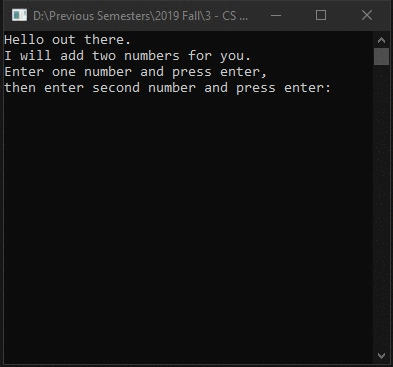

# Homework1Part1
> Sum of 2 numbers

## Screenshot

## Instructions
> Install Microsoft Visual Studio Community 2019  
> (https://www.visualstudio.com/downloads/download-visual-studio-vs  
> (Links to an external site.)).  
> Note: if you have a Mac you will need to use the school VM as the Mac  
> Version of Visual Studio doesn't support WPF which we will use a little  
> in the course.  
> Install the GitHub Visual Studio Extension  
> Compile and run the file MyFirstProgram.cs(copy and paste).  
> Review the code and make sure you understand what is being accomplished.