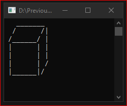

# Homework1Part2
> Simple 3-D box picture

## Screenshot

## Instructions
> Write a program that displays a simple picture of your choice. It could  
> be a car, a house, a flower, a tree, a square, a 3-D box, a star or other  
> shapes.  
> Hint: Write a sequence of WriteLine statements that display lines of  
> asterisks or other characters and blanks.