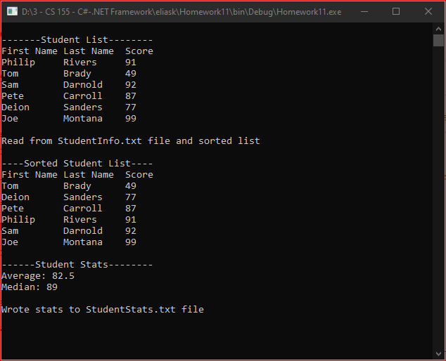

# Homework11
> Use <code>IComparable</code> interface to sort student scores
> Read and write to file

## Screenshot

## Instructions
> For this project you will be combining several concepts.  
> Create a Student class and have the Student Class implement the  
> IComparable interface.  This interface will compare the Student’s score.  
> The Student class with also have first and last name fields.  Create the  
> appropriate constructors as well as getters and setters for the  
> Student class.  
> Create a Student information file.  The file is organized the same way as  
> the Student class.  An example is shown below:  
> 
> Philip Rivers 91  
> Tom Brady 49  
> Sam Darnold 92  
> Pete Carroll 87  
> Deion Sanders 77  
> Joe Montana 99  
> 
> Read in this file and populate a List of Students.  After the list of  
> students is created you will need to compute the average and median of  
> student scores.  You will write this information out to a file called  
> StudentStats.txt.  As a reminder the median calculation will vary whether  
> there is an odd or even number of elements in the list.  
> 
> Hint:  To make this assignment more object oriented you may want to wrap  
> the student class inside another class that allows you to compute all the  
> various aspects that you need.