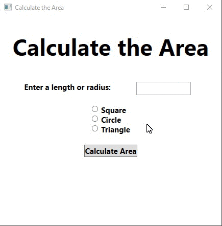

# Homework12
> WPF GUI to calculate area of shapes using delegate

## Screenshot

## Instructions
> Create a WPF application that uses a delegate to calculate the area of a  
> square, circle or triangle.  Have 3 buttons (1 for each shape) that sets  
> the delegate.  Have a fourth button that uses the delegate to calculate  
> the area.  For the area of the triangle have the height and the base be  
> the same value.