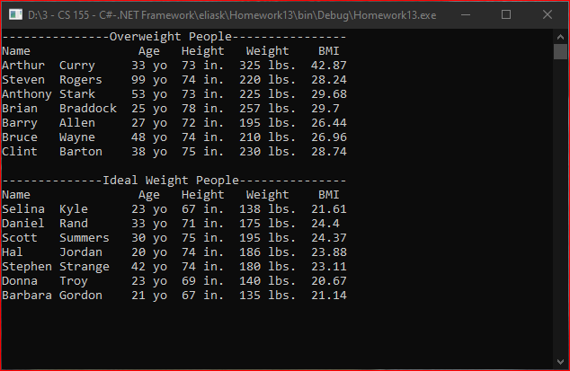

# Homework13
> Calculate BMI and display using queries with LINQ and <code>IEnumerable</code>

## Screenshot

## Instructions
> Try It Out on page 236.  BMI.  
> 
> Write both queries listed in the problem.  You may have to add additional  
> code to the Person class.  
> 
> Make sure that at least 15 people are in your list when attempting the  
> query.