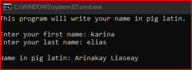

# Homework2Part1
> Write name in pig latin

## Screenshot

## Instructions
> Write a program that start with the string variable first set to your  
> first name and the string variable last set to your last name. Both names  
> should be all lowercase. Your program should then create a new string that  
> contains your full name in pig latin with the first letter capitalized for  
> the first and last name. Use only the pig latin rule of moving the first  
> letter to the end of the word and adding “ay”. Output the pig latin name  
> to the screen. Use Substring and ToUpper methods to construct the new name.  
> For example, given  
> first = “kevin”;  
> last = “lewis”;  
> the program should create a new string with the test “Evinkay Ewislay”