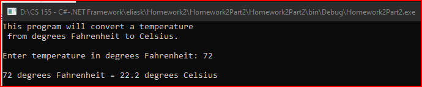

# Homework2Part2
> Convert Fahrenheit to Celius

## Screenshot

## Instructions
> Write a program that converts degrees Fahrenheit to Celsius using the  
> following formula.  
> degreesC = 5(degreesF – 32)/9  
> Prompt the user to enter a temperature in degrees Fahrenheit (just a  
> whole number of degrees without a fractional part), and then let the  
> program print out the equivalent Celsius temperature, including the  
> fractional part to one decimal point. Use the Math.Round(number, decimal)  
> method. A possible dialog might be:  
> Enter a temperature in degrees Fahrenheit:  72  
> 72 degrees Fahrenheit = 22.2 degrees Celsius