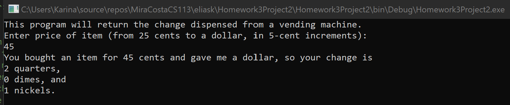
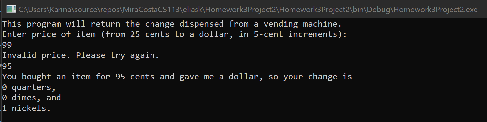

# Homework3Project2
> Change from a vending machine

## Screenshot

## Instructions
> Write a program (Console or GUI) that determines the change to be dispensed  
> from a vending machine. An item in the machine can cost between 25 cents  
> and 1 dollar, in 5-cent increments (25, 30, 35,…,95, 100), and the machine  
> accepts only a single dollar bill to pay for the item. For example, a  
> possible sample dialog might be the following:  
> Output:  
> Enter price of item (from 25 cents to a dollar, in 5-cent increments):  
> 45  
> You bought an item for 45 cents and gave me a dollar, so your change is  
> 2 quarters,  
> 0 dimes, and  
> 1 nickels.