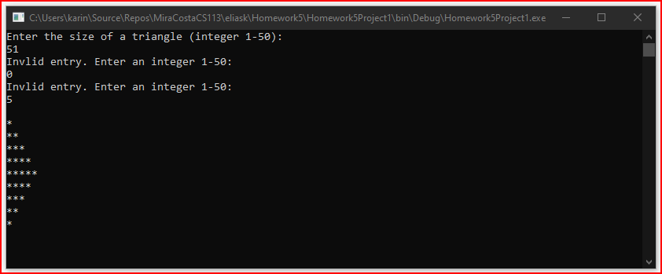
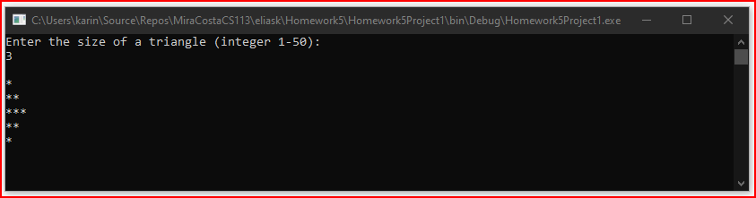
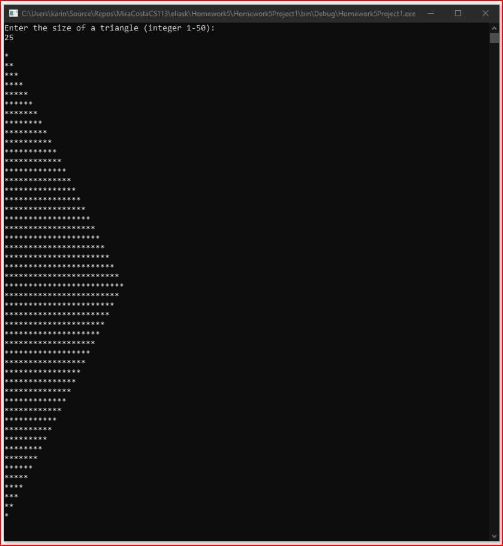

# Homework5Project1
> Display triangle of asterisks

## Screenshot

## Instructions
> Write a program that asks the user to enter the size of a triangle to  
> print out (an integer from 1 to 50), then print the triangle by printing  
> a series of lines consisting of asterisks. The first line will have one  
> asterisk, the next two, and so on, with each line having one more asterisk  
> than the previous line, up to the number entered by the user. On the next 
> line print one less asterisk and continue by decreasing the number of  
> asterisks by 1 for each successive line until only one asterisk is printed.  
> Hint: Use nested for loops; the outside loop controls the number of lines  
> to print, and the inside loop controls the number of asterisks to print  
> on a line. For example, if the user enters 5, the output would be:  
> *  
> 
> **  
> 
> ***  
> 
> ****  
> 
> *****  
> 
> ****  
> 
> ***  
> 
> **  
> 
> *