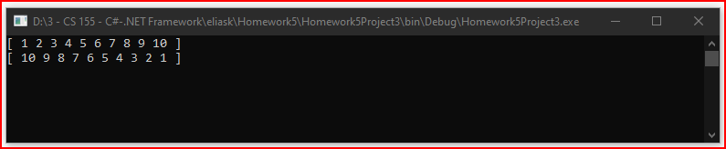

# Homework5Project3
> Display array in reverse

## Screenshot


## Instructions
> Page 97. Try It Out! Reversing an Array  
> Reversing an Array. Let's make a program that uses methods to accomplish  
> a task. Let's take an array and reverse the contents of it. For example,  
> if you have 1, 2, 3, 4, 5, 6, 7, 8, 9, 10, it would become  
> 10, 9, 8 , 7 ,6, 5, 4, 3, 2, 1.  
> 
> To accomplish this, you'll create three methods: one to create the array,  
> one to reverse the array, and one to print the array at the end.  
> 
> Your Main method will look something like this:  
```cs
static void Main(string[] args)
{
    int[] numbers = GenerateNumbers();
    Reverse(numbers);
    PrintNumbers(numbers);
}
```
> The GenerateNumbers method should return an array of 10 numbers.  
> 
> The PrintNumber method should simply use a for or foreach loop to go down  
> the array, one at a time, and print out the items in it.  
> 
> The Reverse method will be the hardest. Give it a try and see what you  
> can make happen, if you get stuck, here's a couple of hints:  
> 
> Hint #1: To swap two values, you will need to place the value of one  
> variable in a temporary location to make the swap:  
```cs
// Swapping a and b
int a = 3;
int b = 5;

int temp = a;
a = b;
b = temp;
```
> Hint #2: Getting the right indices to swap can be a challenge.  
> Use a for loop, starting at 0 and going up the length of the array / 2.  
> The number you use in the for loop will be the index of the first number  
> to swap, and the other one will be the length of the array minus the index  
> minus 1. This is to account for the fact that the array is 0-based.  
> So basically, you'll be swapping array[index] with  
> array[arrayLength - index - 1].