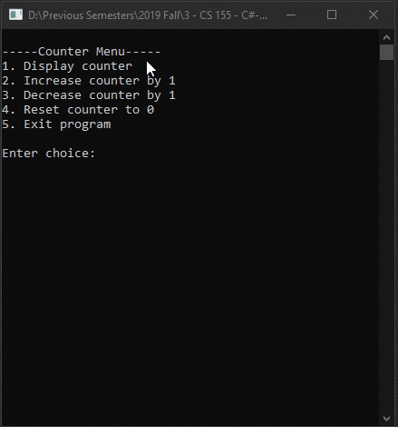

# Homework6Project1
> Create a Counter class

## Screenshot

## Instructions
> Define a class called Counter whose objects count things. An object of  
> this class records a count that is a nonnegative integer. Include methods  
> to set the counter to 0, to increase the count by 1, and to decrease the  
> count by 1. Be sure that no method allows the value of the counter to  
> become negative. Include a getter method that returns the current count  
> value and a method that outputs the count to the screen. There should be  
> no input method or other setter methods. The only method that can set the  
> counter is the one that sets it to 0. Include a ToString methods and a  
> Equals method. Write a driver program that include a menu to interactively  
> test each method in your program.  
> For example, the menu should have an option that test each method and  
> operates on 1 object for example you should be able to select the increment  
> method which would increment your Counter. 