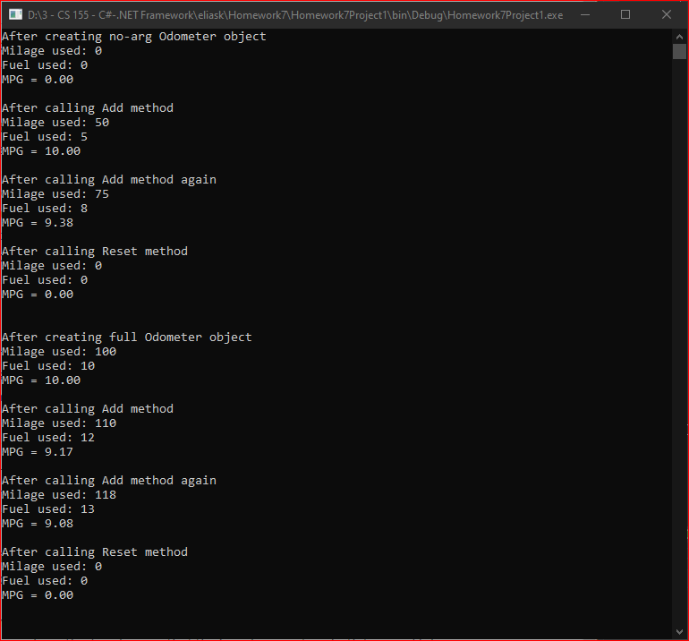

# Homework7Project1
> Odometer class for tracking fuel used and mpg

## Screenshot

## Instructions
> Define a class called Odometer that will be used to track fuel usage and  
> miles per gallon. Create two constructors, 1 constructor should be the  
> no-argument constructor the other will set the two instance variables.  
> The class should have instance variables for mileage driven and fuel used.  
> Include a reset method that sets the mileage drive and the fuel used to zero.  
> Include an add method which takes two parameters that add to the fuel  
> consumed and the miles driven. Finally create a method that returns the  
> miles per gallon and an appropriate ToString method. Write a driver program  
> that tests all the methods and constructors.  Make sure that you protect  
> against division by zero. 