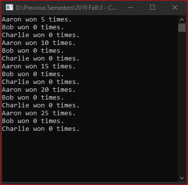

# Homework8
> Determine greatest duelist of all-time in Puzzlevania

## Screenshot

## Instructions
> In the land of Puzzlevania, Aaron, Bob, and Charlie had an argument over  
> which one of them was the greatest puzzler of all time. To end the argument  
> once and for all, they agreed on a duel to the death. Aaron was a poor  
> shooter and only hit his target with a probability of 1/3.  Bob was a bit  
> better and hit his target with a probability of ½. Charlie was an expert  
> marksman and hit 99.5% of his shots.  A hit means a kill and the person hit  
> drops out of the duel.  
> 
> To compensate for the inequities in their marksmanship skills, the three  
> decided that they would fire in turns, starting with Aaron, followed by Bob,  
> and then by Charlie.  The cycle would repeat until there was one man  
> standing, and that mans would be the Greatest Duelist of All-Time.  
> 
> An obvious and reasonable strategy is for each man to shoot at the most  
> accurate shooter still alive, on the grounds that this shooter is the  
> deadliest and has the best chance of hitting back.  
> 
> Write a program to simulate the duel using this stragety.  Your program  
> should use random numbers and the probabilities given in the problem to  
> determine whether a shooter hits the target.  Create a class named Duelist  
> that contains the dueler’s name and shooting accuracy, a Boolean indicating  
> whether the dueler is still alive, and a method ShootAtTarget(Duelist target)  
> that sets the target to dead if the dueler hits his target (using a random  
> number and the shooting accuracy) and does nothing otherwise.  Use properties  
> for your Duelist class.  
> 
> Once you can simulate a single duel, add a loop to your program that  
> simulates 10,000 duels.  Count the number of times that each contestant  
> wins and print the probability of winning for each contestant (ie for Aaron  
> your program might output “Aaron won 3595/10000 duels or 35.95%).  
> 
> An alternate strategy is for Aaron to intentionally miss on his first shot.  
> Modify the program to accommodate this new strategy and output the  
> probability of winning for each contestant.  Which strategy is better for  
> Aaron: to intentionally miss on the first shot or to try and hit the  
> best shooter? Who has the best chance or winning, the best shooter or  
> the worst shooter?  