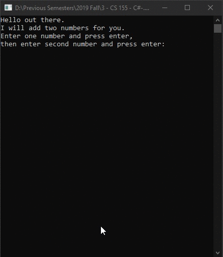

# Lecture1Lab1
> Same as [Homework1Part1](HW/Homework1/Homework1Part1)

## Screenshot

## Instructions
> Ask the user to input two numbers the variables should be n1 and n2 and  
> they should both be integers.  
> Next display to the user the sum something along the lines of “The sum of  
> the two number is” and the actual sum of the numbers.  