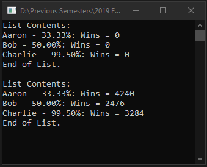

# Lecture10Lab2_Puzzlevania
> Update [Duelist](HW/Homework8) using <code>IComparable</code> interface, List generic, and inheritance

## Screenshot

## Instructions
> To make it more generic we can create a new Duelist type who misses the  
> first shot.  
> Instead of having a regular duelist can we come up with a way to use  
> inheritance to create a duelist.  
> I have set up the derived class Smart Duelist.  