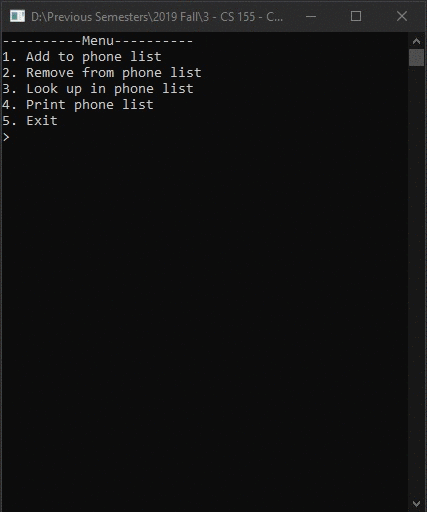

# Lecture11Lab2_Dictionary
> Create phonebook using Dictionary

## Screenshot

## Instructions
> Create a phone lookup program. You should have the ability to add, delete,  
> and find phones number. The key will be a person’s name, for the example  
> use just a first name and this will retrieve a person’s phone number.  
> Use the Dictionary Collection