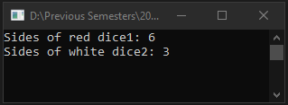

# Lecture12Lab2
> Dice class using optional, named, and variable number of parameters

## Screenshot

## Instructions
> Create a test programs that uses optional parameters, named parameter and  
> variable number of parameters.