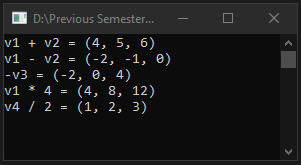

# Lecture13Lab2_3DVectors
> Operator overloading with 3D vectors

## Screenshot

## Instructions
> Pg 218  
> Try It Out!  
> 3D Vectors. Make a Vector class like the one we've created here, but instead  
> of just x and y, also add in z. You'll need to add another property, and  
> the constructor will be a little different.  
> Add operators that do the following:  
> - Add two 3D vectors together. (1, 2, 3) + (3, 3, 3) should be (4, 5, 6).  
> - Subtract one 3D vector from another. (1, 2, 3) - (3, 3, 3) should be  
> (-2, -1, 0).  
> - Negate a 3D vector. For example, using the negative sign on (2, 0, -4)  
> should be (-2, 0, 4).  
> - Multiply a vector by a number (scalar) so (1, 2, 3)*4 should be (4, 8, 12).  
> - Divide a vector by a number (scalar) so (2, 4, 6)/2 should be (1, 2, 3).  
> 
> Additionally, write some code to run some tests on your newly created 3D vector  
> class and check to see if everything is working.