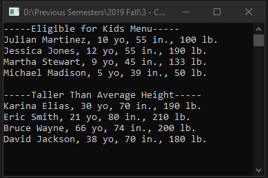

# Lecture13Lab2_LINQ
> LINQ query with <code>IEnumerable</code> to return data set of people

## Screenshot

## Instructions
> - Create the Person class.  
> - Add at least 10 people to a list and create the following statements.  
> - Find the people eligible for the kids menu.  Those who are 12 or younger.  
> - Write a query which list out the people who are taller than the average  
> height of all the people.  Note this does require you to find the average  
> height of the people.  The average you will need to loop over everyone and  
> calculate it.