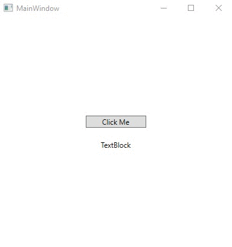

# Lecture14Lab1_NuGet
> Install NuGet package Newtonsoft.Json for JSON use

## Screenshot

## Instructions
> Follow the instructions [here](https://docs.microsoft.com/en-us/nuget/quickstart/install-and-use-a-package-in-visual-studio "How To Install a Package")  
> The lab will use a JSON library.  
> JSON stands for Java Script Object Notation.  
> It has become the de-facto data exchange format due to it’s  
> human-readability, data usage, and ease of use.