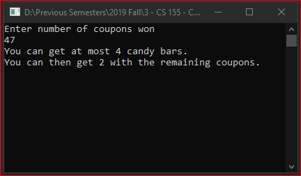

# Lecture2Lab2
> Algorithm to solve # of candy bars & gumballs to get with coupons

## Screenshot

## Instructions
> The video game machine at your local arcade output coupons according to  
> how well you play the game. You can redeem 10 coupons for a candy bar or  
> 3 coupons for a gumball. You prefer candy bars to gumballs. Write a program  
> that defines a variable initially assigned to the number of coupons you win.  
> Next, the program should output how many candy bars and gumballs you can  
> get if you spend all of your coupons on candy bars first, and any remaining  
> coupons on gumballs.  