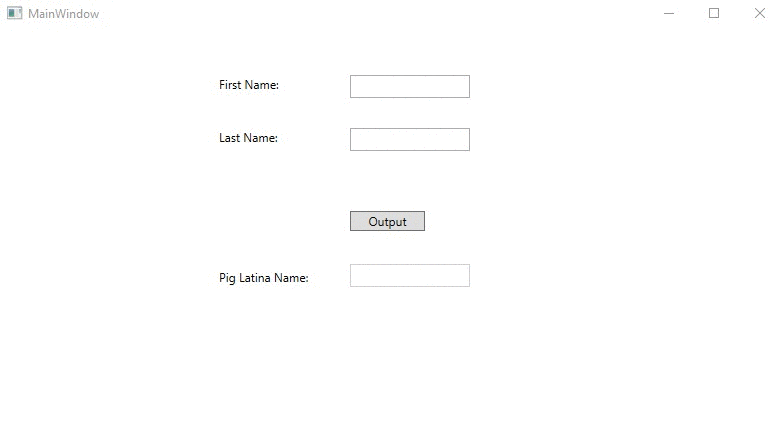

# Lecture3Lab1
> Add WPF GUI to pig latin program ([Homework2Part1](HW/Homework2/Homework2Part1))

## Screenshot

## Instructions
> Write a program that takes in your first and last name. Your program should  
> then create a new string that contains your full name in pig latin with the  
> first letter capitalized for the first and last name.  Use only the pig  
> latin rule of moving the first letter to the end of the word and adding “ay”.  
> Output the pig latin name to the screen.  Use Substring and ToUpper methods  
> to construct the new name.  
> 
> For example, given Kevin Lewis  
> 
> The program should output a new string with the test “Evinkay Ewislay”  
> and print it.