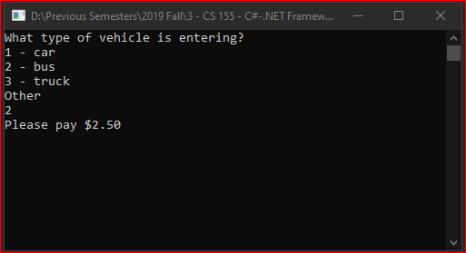

# Lecture3Lab3
> Switch statement to calculate vehicle type toll

## Screenshot

## Instructions
> We need to compute tolls for various vehicle types.  
> 1 – passenger car, toll = $1.50  
> 2 – bus, toll = $2.50  
> 3 – truck, toll = $4.50  
> All other are unknown and charged $5.00.