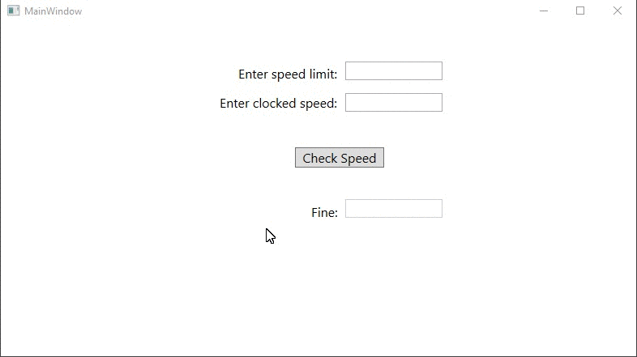

# Lecture4Lab2
> Create WPF GUI for speeding ticket fine

## Screenshot

## Instructions
> create a GUI that takes in a speed limit and your speed.  
> Add a Canvas element that changes color, green (legal speed),  
> yellow (speeding no penalty), red (speeding with penalty).  
> In addition, add a label that in addition to the color  
> prints out the status.