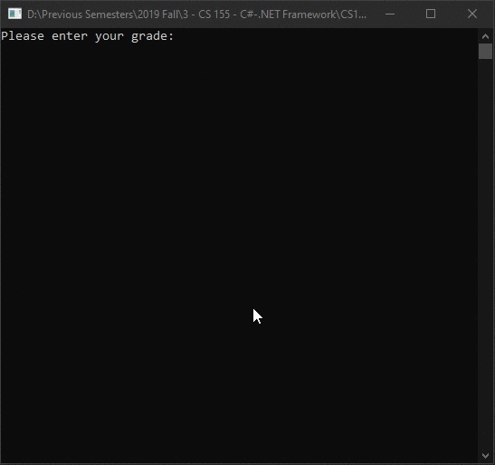

# Lecture4Lab3
> Calculate exam scores average using <code>do-while</code> loop

## Screenshot

## Instructions
> Write a program to read in a list of exam scores (integer percentages in  
> the range 0 to 100) and to output the total number of grades as well as  
> the number of grades in each letter-grade category  
> (90 - 100 = A, 80 - 89 = B, 70 - 79 = C, 60 - 69 = D, and 0 - 59 = F)  
> and what percentage of the total grades each letter grade represents.  
> The end of the input is indicated by a negative score as a sentinel value.  
> (The negative value is used only to end input from the user, so do not use  
> it in the calculations. For example, if the input is  
> 
> 98 87 86 85 85 78 73 72 72 72 70 66 63 50 -1  
> 
> the output could look something like this  
> 
> Total number of grades = 14  
> Number of A’s = 1 which is 7.1%  
> Number of B’s = 4 which is 28.6%  
> Number of C’s = 6 which is 42.9%  
> Number of D’s = 2 which is 14.3%  
> Number of F’s = 1 which is 7.1%  