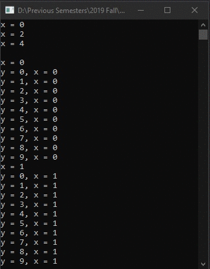

# Lecture4Lab4
> Nested <code>for</code> loop 100 line trace

## Screenshot

## Instructions
> Just as you can nest if statement you can do the same for loops.  
> The inner loop will be execute multiple times.  So if you execute the  
> outer loop m times and the inner loop executes n times then you will  
> execute it m * n times.