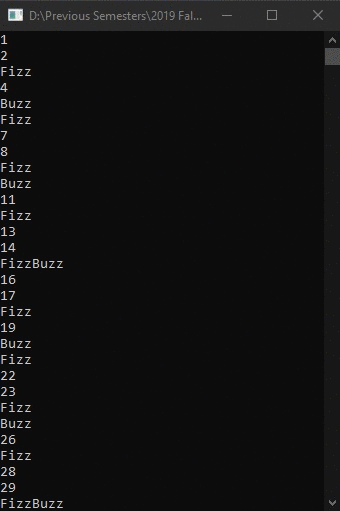

# Lecture5Lab1_FizzBuzz
> Display 0-100, Fizz for x3, Buzz for x5, FizzBuzz for x3 and x5

## Screenshot

## Instructions
> This program gained popularity due to blogs with reference to it and  
> people claiming that they know a particular language.  
> Write a program that prints the numbers from 1 to 100. But for multiples  
> of three print “Fizz” instead of the number and for the multiples of five  
> print “Buzz”. For numbers which are multiples of both three and five print  
> “FizzBuzz”.