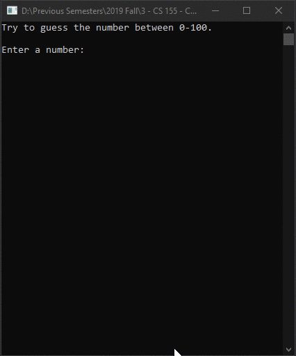

# Lecture5Lab2_GuessingGame
> Random number guessing game between 0-100

## Screenshot

## Instructions
> Create a guessing game.  
> Randomly get a number between 0 and 100, keep looping until you find the  
> number.  For each guess the program should say higher or lower if incorrect  
> (depending on whether its higher or lower).  If correct you should end the  
> game and state how many guesses it took to find the right answer.