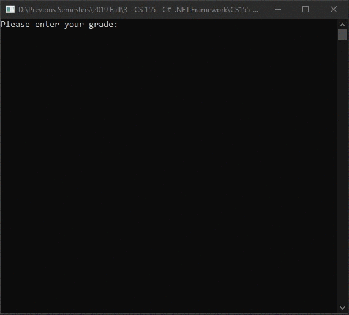

# Lecture5Lab3_GradesUpdated
> Update [Lecture4Lab3](LectureLabs/Lecture4/Lecture4Lab3) to calculate standard deviation

## Screenshot

## Instructions
> Write a program to read in a list of exam scores…  
> 
> 98 87 86 85 85 78 73 72 72 72 70 66 63 50 -1  
> Update our code to also show the average.  
> the output could look something like this   
> 
> Total number of grades = 14  
> Number of A’s = 1 which is 7.1%  
> Number of B’s = 4 which is 28.6%  
> Number of C’s = 6 which is 42.9%  
> Number of D’s = 2 which is 14.3%  
> Number of F’s = 1 which is 7.1%  
> Average = 75.5  
> Standard Deviation = 