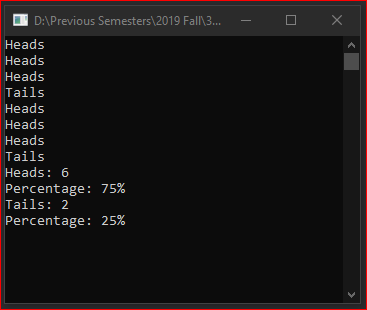
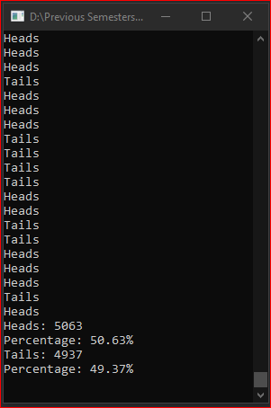

# Lecture5Lab4_CoinFlipArray
> Calculate percentage of heads/tails using an array, enumeration, and random

## Screenshot
> 8 coin flips

> 10,000 coin flips

## Instructions
> Create a program that will store any arbitrary number of coin flips.  
> Let’s say 8 as a starting point (make this a constant).  
> Write a program that randomly flips a coin that number of times  
> (the arbitrary number).  
> At the end show the history of all the coin flips and compute a percentage  
> for that.  
> Next expand this up to 10000 as the number of coin flips.