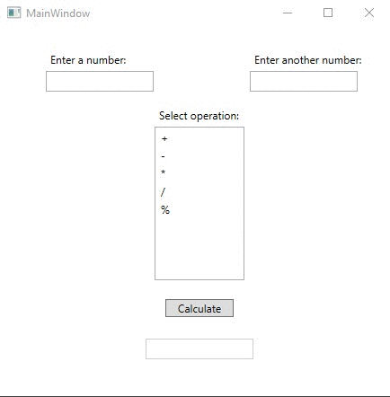

# Lecture6Lab1_Calculator
> WPF GUI Calculator with try/catch block to input validation

## Screenshot

## Instructions
> Create a simple GUI that accepts a left hand value and a right hand value.  
> Use a ListBox to have the user choose (+, -, *, /, %). Use try-catch blocks  
> to handle bad input.  Display a MessageBox notifying the user of the error.  
> Have a button that calculates the results.