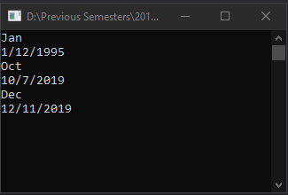

# Lecture6Lab2_Date
> Create Date class using Day, Year, and Month methods

## Screenshot

## Instructions
> Let’s create date class.  
> Need to store day, month and year.  
> Also need to have method (getters and setters).  
> Here are the methods to add:  
> 
> public int getDay()  
> public int getYear()  
> public int getMonth()  
> public void setDay(int newDay)  
> public void setYear(int newYear)  
> public void setMonth(int newMonth)  
> public void setDate(int newMonth, int newDay, int newYear)  
> public String monthString()