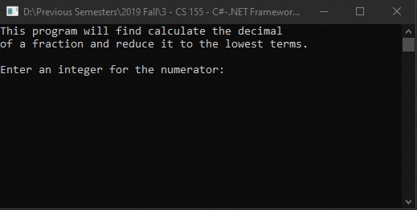

# Lecture6Lab3_Fraction
> Fraction class to reduce to lowest terms

## Screenshot

## Instructions
> Define a class called Fraction.  This class is used to represent a ratio  
> of two integers.  Include setter methods that allow the user to set the  
> numerator and the denominator.  Include a method that returns the value of  
> the numerator divided by the denominator as a double.  Include an additional  
> method that outputs the value of the fraction reduced to lowest terms  
> (ie instead of outputting 20/60 output 1/3).  This will require finding the  
> greatest common denominator, then dividing both by that number.  Embed your  
> class in a test program.