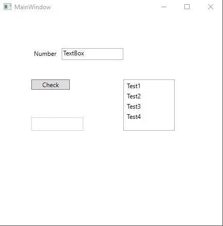

# Lecture6Lab4_Input
> WPF GUI input validation with ListBox

## Screenshot

## Instructions
> Example for [Lecture6Lab1_Calculator](../Lecture6Lab1_Calculator) of output with TextBox and ListBox selection.  
> Also displays error message if invalid input is determined.