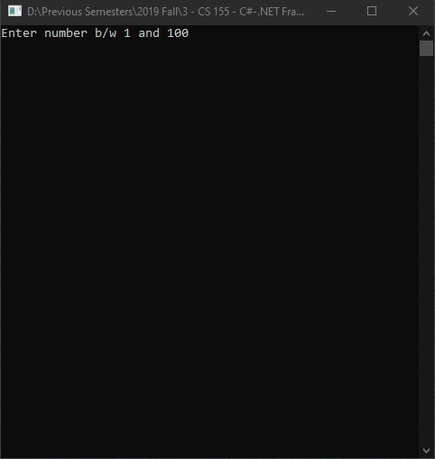

# Lecture6Lab6_Try2
> Throwing an Exception

## Screenshot

## Instructions
> Write your code within a try block .  When the code runs, it attempts to  
> execute all the statements in the try block, and if none of the statements  
> in the try block, and if none of the statements generates an exception, they  
> all run, one after the other, to completion.  However, if an error condition  
> occurs, execution jumps out of the try block and into another piece of code  
> designed to catch and handle the exception – a catch handler.  
> 
> Write one or more catch handlers immediately after the try block to handle  
> any possible error conditions.  A catch handler is intended to capture and  
> handle a specific type of exception, and you can have multiple catch handlers  
> after a try block, each one designed to trap and process a specific exception;  
> you can provide different handlers for the different errors that could arise  
> in the try block.  If any one of the statements within the try block causes  
> an error, the runtime throws an exception.  The runtime then examines the  
> catch handlers after the try block and transfers control directly to the  
> first matching handler.  
> 
> It is important to remember that when an exception is thrown it changes the  
> flow of execution through the program.  That means that you can’t guarantee  
> a statement will always run when the previous statement finishes because the  
> previous statemet might throw an exception.  
> 
> The finally block of code will guarantee that code is run whether or not you  
> threw an exception.