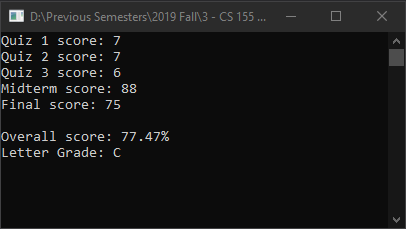

# Lecture7Midterm
> Calculate weighted grade using derived methods

## Screenshot

## Instructions
> Define a class for the student record. The class should have instance  
> variables for the quizzes, midterm, and final. The overall numeric score  
> is a number in the range 0 to 100, which represents the weighted average  
> of the student’s work. The class should have methods to compute the overall  
> numeric grade and the final letter grade.  These last methods should are not  
> as derived methods as your class doesn’t provide an instance variable but  
> calculates it as you go. Your class should have a reasonable set of setters  
> and getters, an Equals method and a ToString method.  You may also add other  
> methods as you see fit.