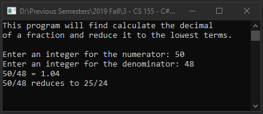

# Lecture8Lab2_Fraction
> Update [Lecture6Lab3_Fraction](LectureLabs/Lecture6/Lecture6Lab3_Fraction) using properties

## Screenshot

## Instructions
> Update your Fraction class from earlier in the year to use properties  
> instead of Getter and Setter methods.