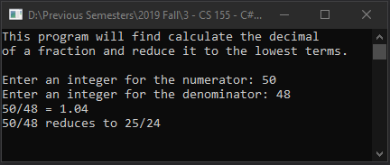

# Lecture9Lab1_Fraction
> Update [Lecture8Lab2_Fraction](LectureLabs/Lecture8/Lecture8Lab2_Fraction) using a struct

## Screenshot

## Instructions
> Update your Fraction class to a struct. Copy and paste your code to a new project