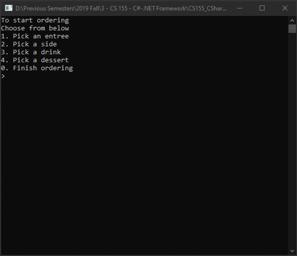

# MidtermExtraCredit
> Simple restaurant bill calculator

## Screenshot

## Instructions
> Create a project that requires you to create a class and implement somthing  
> that you can use outside CS 155. Points are determined by usefulness of the  
> program, creativity, and originality.

## Tasks
> [ ] Message to user before exiting program  
> [ ] Display price of each item to user  
> [ ] Add `List` for menu items  
> [ ] Display full list of items in current order (see [Lecture8Lab1_Pizza](LectureLabs/Lecture8/Lecture8Lab1_Pizza))  
> [ ] Implement as WPF GUI  